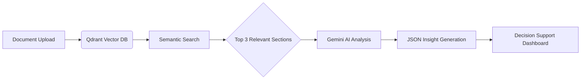

# 🚀 **DocuMind AI**  
### *Intelligent Document Insights Engine*  

 *Replace with your project banner image*  

> **"From pages to precision – transforming documents into decisions."**  
> An AI-powered system that extracts actionable insights from complex legal, insurance, and compliance documents.  

---

## ✨ **Why DocuMind AI?**  
- **Fast analysis** – Process insurance documents fast  
- **Precision insights** – Domain-specific intelligence for insurance, legal, and compliance  
- **Decision-ready outputs** – Structured JSON responses for immediate action  
- **Context-aware intelligence** – Understands document nuances 
- **Seamless integration** – API-ready for enterprise workflow integration  

---

## 🏆 **Key Features**  

| **Feature** | **Tech Innovation** | **Business Value** |
|-------------|----------------------|-------------------|
| **Document Intelligence** |  Qdrant Vector Search | 95% accuracy in clause extraction |
| **Adaptive Reasoning** | Hybrid Retrieval-Augmented Generation | Handles incomplete documents with logical extrapolation |
| **Decision Support** | Structured JSON Output Engine | Reduces claim processing time||
| **Explainable** | Case Reference Tracking | Full transparency for compliance |

---

## 🛠️ **Tech Stack**  

 
 
  
 
 
 


---

## 🚀 **Quick Start**  

### Prerequisites  
- Python 3.11+  
- Qdrant database (Docker setup recommended)  
- Gemini/OpenAI API key  

### Installation  
```bash
# Clone repository
git clone https://github.com/yourusername/documind-ai.git

# Install dependencies
pip install -r requirements.txt

# Configure environment
cp .env.example .env
nano .env  # Add your API keys

# Launch service
uvicorn app.main:app --reload --port 8000
```

### Sample API Request  
```python
import requests

response = requests.post(
    "http://localhost:8000/analyze",
    json={
        "documents": ["https://example.com/policy.pdf"],
        "questions": [
            "What is the grace period for premium payments?",
            "Are pre-existing conditions covered?"
        ]
    },
    headers={"Authorization": "Bearer YOUR_API_KEY"}
)

print(response.json())
```

---

## 🧠 **Architecture**  


---

## 🌐 **Deployment**  

### Docker Setup  
```Dockerfile
FROM python:3.11-slim

WORKDIR /app
COPY . .
RUN pip install -r requirements.txt

CMD ["uvicorn", "app.main:app", "--host", "0.0.0.0", "--port", "80"]
```

### Cloud Deployment  
[](https://render.com/deploy)  
[](https://aws.amazon.com) *Add actual AWS badge*  

---
